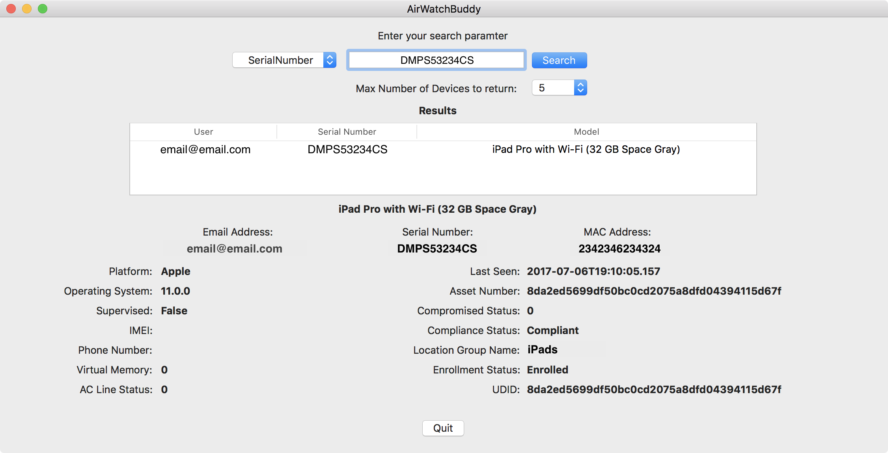

# AirWatchBuddy

AirWatchBuddy is a simple API companion app that will pull device information from your AirWatch instance. It was written with the API guide for **AirWatch 9.0** and up, as well as for **macOS 10.12** and up. Older AirWatch instances and versions of OS X have not been tested.

The information can be retrieved using one of 5 queries:
* UserName - Can be a username, partial username or will search as a wildcard string. 
* I.e. User `bakerjr`'s devices will be returned with a search for `baker` among any other Baker's in your organization
* Or you can leave it empty and it will return all devices to the limit specified (i.e. 5, 50, 100)
* SerialNumber - The device's Serial Number
* IMEI - The device's IMEI number
* MAC Address - The device's MAC Address
* UDID - The device's UDID as defined in AirWatch

AirwatchBuddy requires the FQDN or IP address for your AirWatch server, as well as your AW Tenant Code (your API code) and a username and password for an account with API privileges. This information is all stored in the user's default keychain.

AirWatchBuddy also places a preference file on disk under `~/Library/Preferences/com.jbakersystems.AirWatchBuddy` where both the `ServerURL` and `Username` info is kept. These fields are used to key off of and search for your keychain entry to authenticate for the API call.

## Things to do

* I'd like to add the ability to perform actions as well through the API calls, such as changing groups, or running commands on the device
* Add right-click feature that will open many more API calls
  * Get GPS info (API URL for GPS info (`https://host/api/mdm/devices/gps/search?searchby={searchby}&startdatetime= {startdatetime}&enddatetime={enddatetime}&dayrange={dayrange}`)
  * Get installed Profile info (`https://host/api/mdm/devices/{id}/profiles?page={page}&pagesize={pagesize}`)
  * Get installed Application info
  * Get Network info (`https://host/api/mdm/devices/{id}/network`)
  * Get Security info (`https://host/api/mdm/devices/{id}/security`)
  * and more... 
* Possibly change the name and/or logo
* Continue polishing the UI

## Credits

* Tom Burgin - Thanks for teaching me and helping me create this app!
* AirWatchBuddy icon by [New Haricut](https://thenounproject.com/newhaircut/)

## License

Copyright 2017 Jeremiah Baker.

Licensed under the Apache License, Version 2.0 (the "License"); you may not use this file except in compliance with the License. You may obtain a copy of the License at

`http://www.apache.org/licenses/LICENSE-2.0`

Unless required by applicable law or agreed to in writing, software distributed under the License is distributed on an "AS IS" BASIS, WITHOUT WARRANTIES OR CONDITIONS OF ANY KIND, either express or implied. See the License for the specific language governing permissions and limitations under the License.
